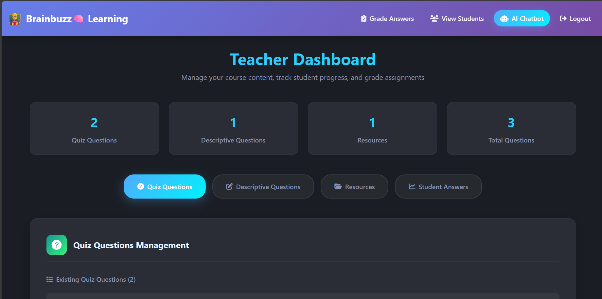
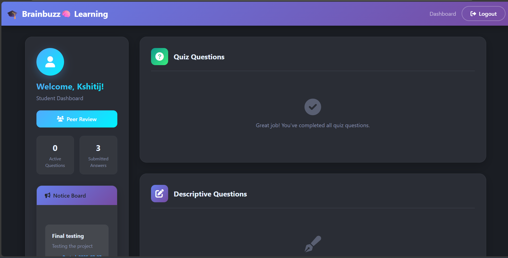
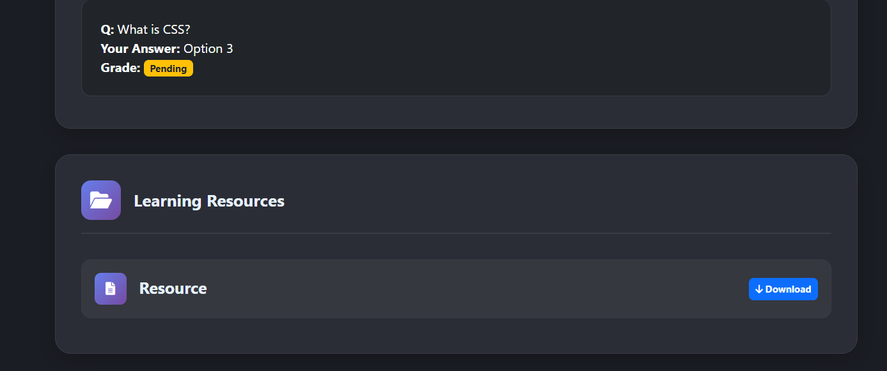
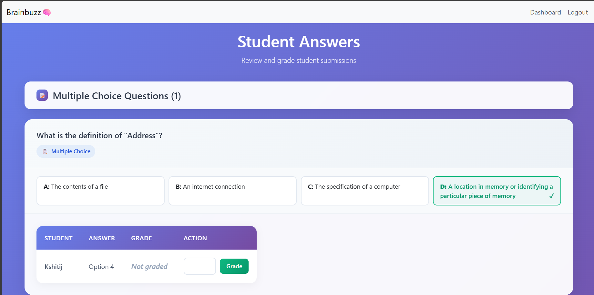

# BrainBuzz
BrainBuzz is a modern, full-stack learning platform for teachers and students. Features include interactive quizzes, resource sharing, grading, peer review, announcements, and an AI-powered teacher assistant chatbot. Built with FastAPI, SQLAlchemy, MySQL, and a responsive Bootstrap frontend
=======
# 🧠 BrainBuzz

**BrainBuzz** is a modern, full-stack learning platform for teachers and students.
It features interactive quizzes, descriptive questions, peer review, resource sharing, grading, announcements, and an AI-powered teacher assistant chatbot. Built with FastAPI, SQLAlchemy, MySQL, and a responsive Bootstrap frontend.

---

## 🚀 Features

- **Student & Teacher Authentication**
- **MCQ & Descriptive Questions**
- **Peer Review System**
- **Notice Board for Announcements**
- **Resource Sharing (Notes, Videos)**
- **Teacher AI Chatbot Assistant**
- **Modern, Responsive UI**
- **Grading & Feedback**
- **Role-based Dashboards**

---

## 📸 Screenshots

| Dashboard (Teacher) | Dashboard (Student) | Resource Sharing | Grading Interface |
|---------------------|---------------------|------------|------------------|------------------|
|  |  |  |  |


---


## Features

- Student and Teacher authentication
- MCQ and Descriptive question support
- Peer review system for descriptive answers
- Notice board for teacher-to-student communication
- Resource sharing (notes, videos)
- Teacher AI chatbot assistant
- Modern, responsive UI

---

## Prerequisites

- **Python 3.8+**
- **MySQL Server** (or MariaDB)
- **Node.js & npm** (if you plan to use/build frontend assets)
- **Git** (to clone the repository)

---

## 1. Clone the Repository

```bash
git clone https://github.com/yourusername/piazza-learning-platform.git
cd piazza-learning-platform/backend
```

---

## 2. Set Up the Python Environment

```bash
python -m venv venv
# On Windows:
venv\Scripts\activate
# On Mac/Linux:
source venv/bin/activate

cd backend
pip install -r requirements.txt

```

---

## 3. Configure the Database

1. **Install MySQL** if you don't have it already.
2. **Create a database and user:**

```sql
CREATE DATABASE piazza;
CREATE USER 'piazza_user'@'localhost' IDENTIFIED BY 'PiazzaPass123!';
GRANT ALL PRIVILEGES ON piazza.* TO 'piazza_user'@'localhost';
FLUSH PRIVILEGES;
```

3. **Set up the environment variables:**

Copy `.env.example` to `.env` and edit as needed:

```env
MYSQL_USER=piazza_user
MYSQL_PASSWORD=PiazzaPass123!
MYSQL_HOST=localhost
MYSQL_DB=piazza
SECRET_KEY=your_secret_key_here
OPENROUTER_API_KEY=your_openrouter_api_key_here  # Required for teacher chatbot
```

---

## 4. Initialize the Database Schema & Migrate

Run the following migration scripts in order to set up all tables and columns:

```bash
python migrations/add_notice_tables.py
python migrations/add_teacher_id_to_notices.py
python migrations/drop_posted_by_from_notices.py
python migrations/add_peer_review_column.py
python migrations/add_timestamp_column.py
```

- (Optional, for debugging) To check your notices data:
```bash
python migrations/check_notices_data.py
```

- If you see a duplicate column error, it means the migration has already been applied and you can continue.
- If you have SQL scripts (e.g., `add_peer_review.sql`), you can run them as:
```bash
mysql -u piazza_user -p piazza < migrations/add_peer_review.sql
OR
ALTER TABLE answers ADD COLUMN is_peer_review BOOLEAN DEFAULT FALSE;
```
Do run this command in your database : 
ALTER TABLE questions ADD COLUMN deadline DATETIME;
---

## 5. Run the Application

```bash
uvicorn main:app --reload
```

- The app will be available at [http://localhost:8000](http://localhost:8000)

---

## 6. (Optional) Frontend Assets

If you want to build or modify frontend assets:

```bash
cd ../frontend
npm install
npm run build
```

---

## 7. Default Accounts

- **Register as a teacher or student** via the web interface.
- (Optional) You can pre-populate users and questions via the database or by extending the backend.

---

## Notice Board System
- Teachers can post notices to all or selected students.
- Students see notices on their dashboard after logging in via `/student/dashboard`.
- If notices are missing, ensure the student is logging in via `/student/dashboard` and the backend is using the correct student ID type.

---

## Peer Review System
- Students can submit peer reviews for descriptive questions, even after submitting their own answer.
- After submitting a peer review, the form is hidden and a confirmation message is shown.
- Only one peer review per question is allowed.

---

## Login Redirects
- Students are redirected to `/student/dashboard` after login.
- Teachers are redirected to `/dashboard` after login.
- If you see the wrong dashboard, check your role and the redirect logic.

---

## Troubleshooting
- **Database errors:** Ensure MySQL is running and credentials in `.env` are correct.
- **Missing columns:** Re-run the migration scripts in the `migrations/` folder.
- **Duplicate column error:** This means the migration has already been applied; you can continue.
- **404 after peer review:** Ensure all peer review redirects use `/student/peer-review`.
- **Notices not visible:** Ensure the student dashboard route is `/student/dashboard` and the student ID is compared as an integer.
- **Peer review form not hiding:** Ensure backend and template are updated to check for existing peer review answers.
- **Port in use:** Change the port in the `uvicorn` command if 8000 is busy.

---

## Contributing

Pull requests are welcome! For major changes, please open an issue first to discuss what you would like to change.

---

## License

[MIT](LICENSE)

---

## Acknowledgements

- FastAPI
- SQLAlchemy
- Jinja2
- Bootstrap
- OpenRouter API 

BrainBuzz/
├── backend/
│   ├── main.py
│   ├── auth.py
│   ├── student.py
│   ├── teacher.py
│   ├── teacher_view.py
│   ├── models.py
│   ├── database.py
│   ├── requirements.txt
│   ├── static/
│   ├── templates/
│   └── ...
├── screenshots/
│   ├── teacher_dashboard.png
│   ├── student_dashboard.png
│   ├── chatbot.png
│   ├── resources.png
│   └── grading.png
└── README.md

